# Your Friendly Berlin City Air Quality Forecasting Service

by Benedict Wolff & Kasper Malm as part of the course [Scalable Machine Learning and Deep Learning](https://canvas.kth.se/courses/57476) at KTH Royal Institute of Technology

## Summary

This forecasting service predicts Berlin’s PM2.5 levels one week ahead using historical air-quality data, weather forecasts, and machine-learning pipelines. It integrates with Hopsworks, AQICN, and MeteoSource, supports multiple feature setups (base, cloud cover, lagged), and automates feature ingestion, model training, and batch inference to generate a dashboard that is deployed at [wolffbe.github.io/mlfs-book/air-quality/](https://wolffbe.github.io/mlfs-book/air-quality/).

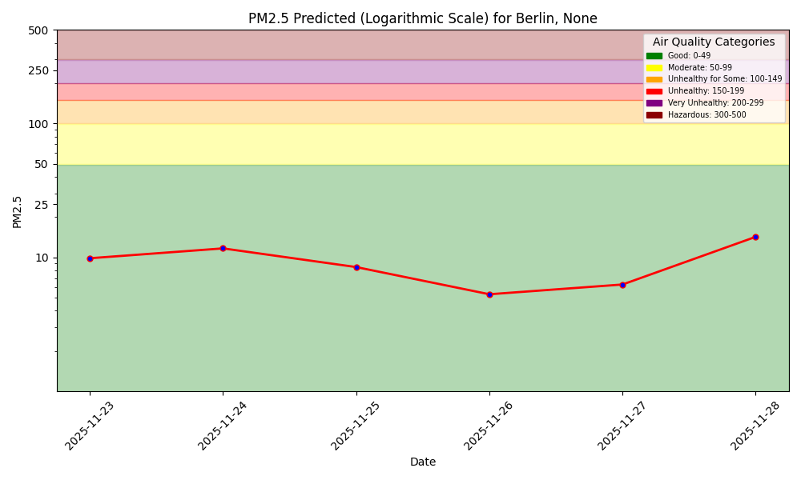

## Minimum Viable Prediction Service (MVPS) Kanban Board

The MVPS Kanban outlines the frameworks and tools needed to build this end-to-end prediction service.

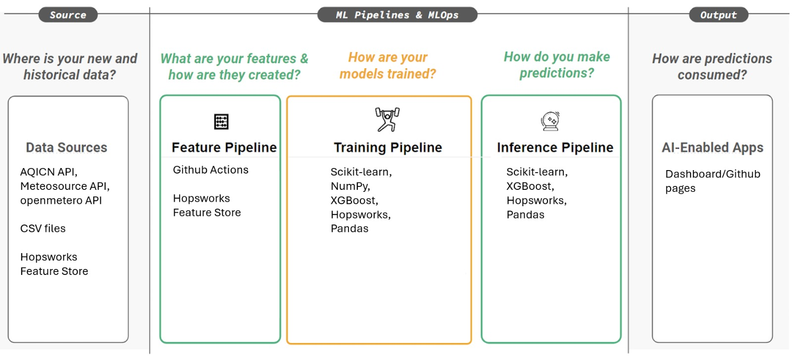

The forecasting service uses the following tools:

- Hopsworks Feature Store for storing and serving features
- AQICN API for air-quality sensor data
- MeteoSource API for cloud-cover and weather data
- GitHub Actions for automated ingestion, training, and inference
- XGBoost for model training
- Python ecosystem (Jupyter, uv, invoke, dotenv)
- Conda for environment management
- Matplotlib for dashboard visualization

## Setup

### Single sensor

1. Choose a sensor on [AIGC](https://aqicn.org/)
2. Manually download the PM2.5 history of that sensor as a CSV
3. Create a [Hopsworks](https://www.hopsworks.com/) account
4. Create a [Meteosource](https://www.meteosource.com/) account (historical data CSV downloads require a subscription)

4. Clone this repository

```bash
git clone https://github.com/wolffbe/mlfs-book.git

cd mlfs-book
```

5. Configure environment

```bash
mv .env.example .env

vim .env
```

```bash
HOPSWORKS_API_KEY=<your_key>
HOPSWORKS_HOST=c.app.hopsworks.ai
HOPSWORKS_PROJECT=<your_project>
AQICN_API_KEY=<your_key>
AQICN_URL=<sensor_url>
AQICN_COUNTRY=<country>
AQICN_CITY=<city>
AQICN_STREET=<street>
```

6. Setup environment and install dependencies

```bash
conda create -n aq python==3.10

conda activate aq

pip install uv invoke python-dotenv
```

7. Add historical data to `data`
8. Run `jupyter notebook` and open the `notebooks` folder

### Regional data

Add all sensors that should be tracked to a csv such as [berlin.csv](/data/berlin.csv), and add the historical data for each sensor as well.

### Daily schedule

Add the following values to Github Actions via the `Settings` page of your repository:

#### Repository variables

```bash
AQICN_CITY
AQICN_COUNTRY
AQICN_STREET
AQICN_URL
HOPSWORKS_HOST
HOPSWORKS_PROJECT
```

#### Repository secrets

```bash
AQICN_API_KEY
HOPSWORKS_API_KEY
METEOSOURCE_API_KEY
```

## Run

The repository includes five base notebooks taken from the original repository [mlfs-book](https://github.com/featurestorebook/mlfs-book).

This repository extends all five notebooks three times by adding cloud coverage from Meteosource, cloud coverage and a three-day lag as well as support for forecasting regional air quality based on multiple sensors.

All execution types covering one or multiple sensors consist of a feature backfill, daily feature pipeline, training pipeline, and batch inference pipeline.

### Feature Backfill

- [1_air_quality_feature_backfill.ipynb](notebooks/airquality/1_air_quality_feature_backfill.ipynb)

This notebook prepares historical air-quality and weather data for use in an ML pipeline by retrieving the manually provided CSV containing PM2.5 data, cleaning it, validating it, enriching it with metadata, retrieving matching historical weather features, defining data-quality rules, and finally creating and populating feature groups in Hopsworks for air quality and weather.

Sensor data can be collected from multiple locations, e.g. from Berlin, by running the

```
python notebooks/0_air_quality_feature_batch.py --notebook 1_air_quality_feature_backfill_berlin.ipynb --csvfile data/berlin.csv
```

which uses [0_air_quality_feature_batch.ipynb](notebooks/airquality/0_air_quality_feature_batch.py) to invoke instances of [1_air_quality_feature_backfill_berlin.ipynb](notebooks/airquality/1_air_quality_feature_backfill_berlin.ipynb) using parameters defined in [berlin.csv](data/berlin.csv).

### Feature Pipeline

- [2_air_quality_feature_pipeline.ipynb](notebooks/airquality/2_air_quality_feature_pipeline.ipynb)

This pipeline runs daily to fetch the current day’s PM2.5 air-quality data, and weather forecast, validate them, and append them to the corresponding Hopsworks feature groups for air quality, weather, and cloud cover.

Sensor data can be collected from multiple locations by running:

```bash
python notebooks/0_air_quality_feature_batch.py --notebook 2_air_quality_feature_pipeline_berlin.ipynb --csvfile data/berlin.csv
```

which uses [0_air_quality_feature_batch.ipynb](notebooks/airquality/0_air_quality_feature_batch.py) to invoke instances of [2_air_quality_feature_pipeline_berlin.ipynb](notebooks/airquality/2_air_quality_feature_pipeline_berlin.ipynb) based on parameters defined in [berlin.csv](data/berlin.csv).


### Training

- [3_air_quality_training_pipeline](notebooks/airquality/3_air_quality_training_pipeline.ipynb)
- [3_air_quality_training_pipeline_cloud_cover](notebooks/airquality/3_air_quality_training_pipeline_cloud_cover.ipynb)
- [3_air_quality_training_pipeline_cloud_cover_lag](notebooks/airquality/3_air_quality_training_pipeline_cloud_cover_lag.ipynb)

This notebook creates a training pipeline that reads air quality and weather features from Hopsworks, builds a feature view, splits the data into training and test sets, trains an XGBoost regression model to predict PM2.5, evaluates performance with metrics and plots, and saves the model and artifacts to the Hopsworks model registry.

When training with data from multiple sensors, the means of all locations per day is calculated, e.g. in [3_air_quality_training_pipeline_berlin.ipynb](notebooks/airquality/3_air_quality_training_pipeline_berlin.ipynb):

```python
df_aggregated = data.groupby('date').agg({
    'pm25': 'mean',
    'temperature_2m_mean': 'mean',
    'precipitation_sum': 'mean',
    'wind_speed_10m_max': 'mean',
    'wind_direction_10m_dominant': 'mean'
}).reset_index()
```

### Batch Inference

- [4_air_quality_batch_inference](notebooks/airquality/4_air_quality_batch_inference.ipynb)
- [4_air_quality_batch_inference_cloud_cover](notebooks/airquality/4_air_quality_batch_inference_cloud_cover.ipynb)
- [4_air_quality_batch_inference_cloud_cover_lag](notebooks/airquality/4_air_quality_batch_inference_cloud_cover_lag.ipynb)

This notebook performs batch inference for air quality: it retrieves the trained XGBoost model from Hopsworks, fetches weather forecast features, predicts PM2.5 levels, stores the predictions in a monitoring feature group, generates forecast and hindcast graphs, and uploads the visualizations to Hopsworks.

[4_air_quality_batch_inference_berlin.ipynb](notebooks/airquality/4_air_quality_batch_inference_berlin.ipynb) can be used when training with data from multiple sensor locations.

## Results

Running backfill, the feature pipeline, training, and batch inference based on historical air quality, cloud cover, lag, and multiple sensors produced the following results:

### Historical air quality

#### Training

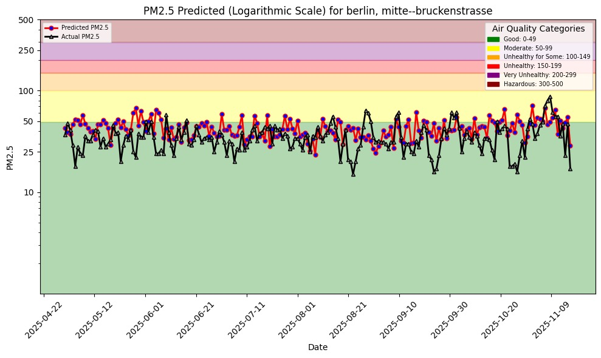
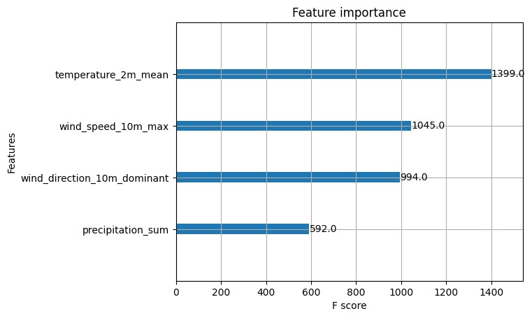

#### Prediction

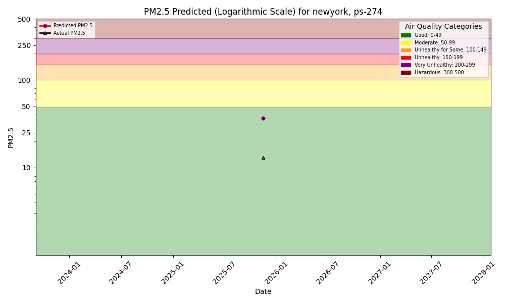

### Cloud cover

#### Training


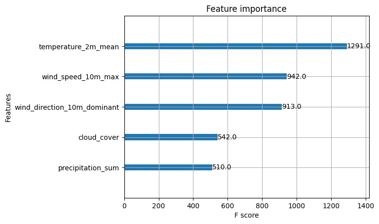

#### Prediction

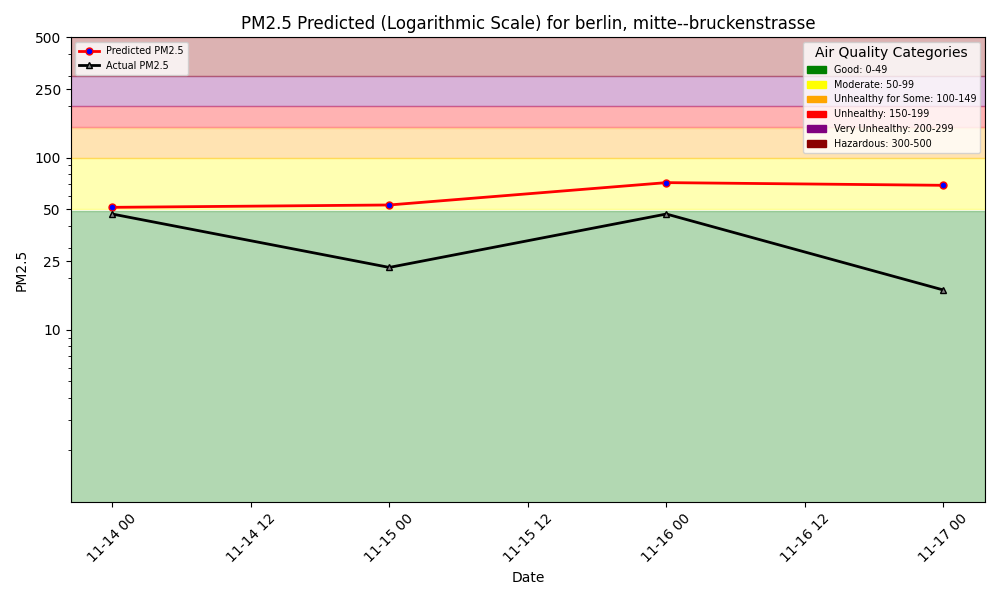

### Cloud cover and lag

#### Training

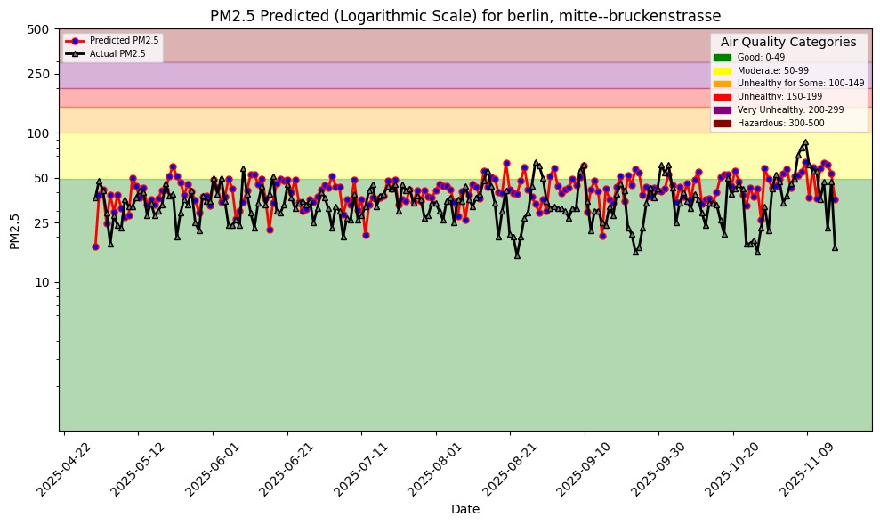


#### Prediction

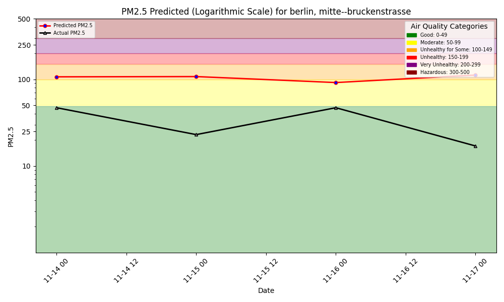

### Berlin (12 sensors)

#### Training

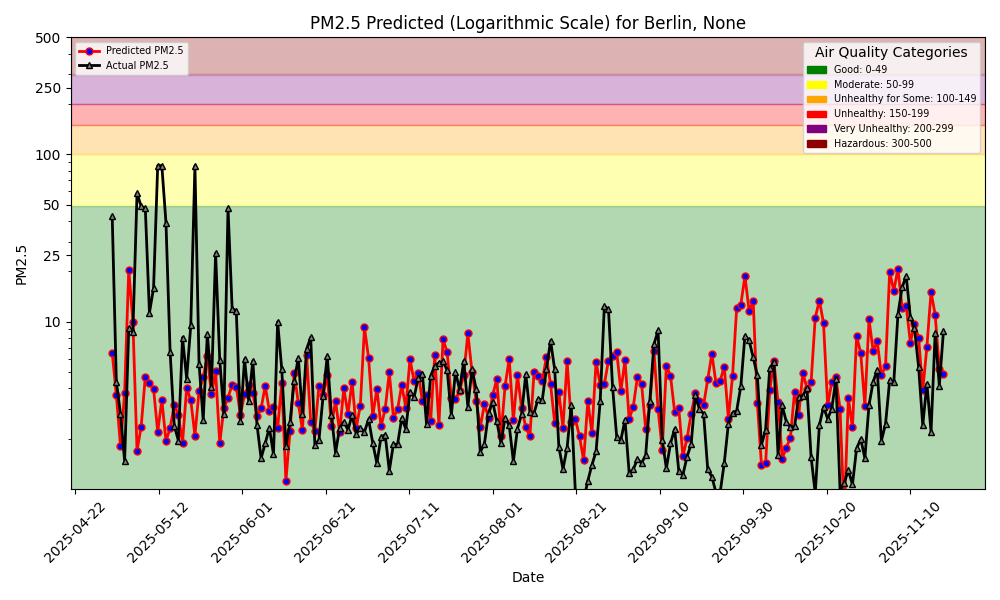
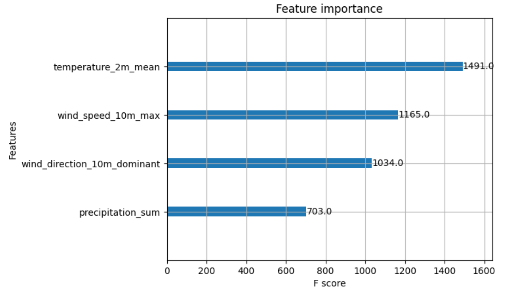

#### Prediction

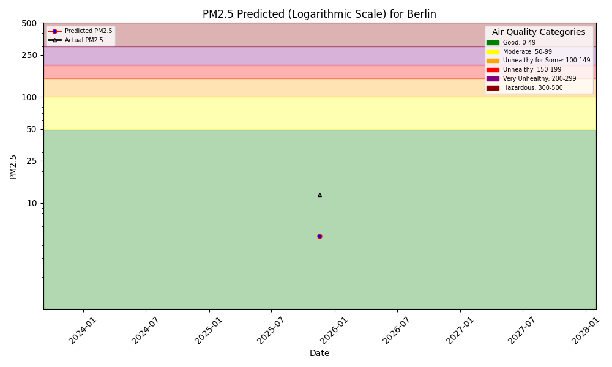

## Discussion

The model using only air quality data performed poorly during training, with a mean error of 7.24, RMSE of 15.45, and R² of -0.80, indicating predictions worse than a mean-based baseline. Adding cloud coverage slightly reduced the mean error but increased variability and further decreased R² to -0.95, suggesting limited predictive value. Additionally included lag features improved performance across all error metrics (MAE 11.26, RMSE 14.36, R² -0.56), showing that temporal dependencies enhance model accuracy. For the Berlin dataset with twelve sensors, errors were lower (MAE 5.08, RMSE 13.31, R² -0.10), indicating that spatial aggregation improves predictability.

## Conclusion

The evaluation shows that including cloud cover alongside air quality data improved predictive performance during inference, even without lag features, whereas adding lag features provided the best results during training but did not necessarily translate to better inference performance. Temperature, wind speed, and wind direction remain the most influential predictors, with lagged wind variables contributing to capturing temporal patterns. Key challenges included sourcing reliable sensor data and adapting the pipeline to accommodate additional features, particularly lagged variables, which required extensive modifications. Overall, the results emphasize the need to balance feature complexity with generalization and highlight the importance of meteorological factors in predicting PM2.5 concentrations.

## Acknowledgements

Our forecasting service is based on the repository [mlfs-book](https://github.com/featurestorebook/mlfs-book), chapter three of the corresponding O'Reilly's _Building Machine Learning Systems with a Feature Store_ by [Jim Dowling](https://github.com/jimdowling), and the first lab that we conducted as part of the course [Scalable Machine Learning and Deep Learning](https://canvas.kth.se/courses/57476) at KTH Royal Institute of Technology.